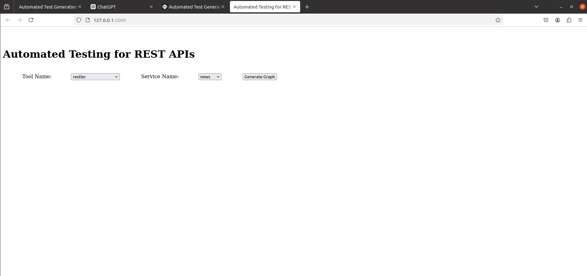

# Automated Test Generation for REST APIs: No Time to Rest Yet Implementation

## Team Members
- Harshil Kaneria (B21CS033)
- Amisha Kumari (B21CS007)
- Maithili Borage (B21CS042)

## Getting Started

### Check the basic functionality

In this section, we give detailed instructions to check the basic functionality of this artifact.
We show how to use the REST-API testing tools used in our study to test the project-tracking-system service.

### Requirements

We used machines running Ubuntu 20.04 for this project with the software listed below installed. Note that the setup script is tested in Ubuntu 20.04.

- Required software: Java8, Java11, Git, Sudo, Wget, zip, unzip, MVN, Gradle, Python3.8-pip, Virtualenv, NodeJS v10.19, and Docker 20.10. 

### Setup

You can manually install the required software. Or, if you use the same testing environment that we used, you can run the command below for setup.

```
cd REST_API_TESTING # Go to the root directory
sh small_setup.sh
```

It will take around 20 minutes to finish setup.


### Run

You can test the service with a tool using `run_small.py`, a python script to test the service for six minutes.
To use this script, you should provide the tool's name and a port number. Possible tools' names are`evomaster-whitebox`, `evomaster-blackbox`, `restler`, `restest`, `resttestgen`, `bboxrt`, `schemathesis`, `dredd`, `tcases`, and `apifuzzer`.
You can use any available port number. You should use a different port number for each run, otherwise the code coverage will be based on the previous runs. The port number is used for collecting the achieved code coverage.
Before running the script, make sure that you use `virtualenv`.
Also, we need to check if there is already running session. You can check the running sessions using "tmux ls" command. If there is running session, you should kill the session before running a new experiment.
You can kill the session with "tmux kill-sess -t {session name}." You should find the session name in "tmux ls" command if there is any.

```
source venv/bin/activate
python3 run_small.py {tool_name} {port_number}
```

It will automatically start the service and the script for getting coverage.

### Generate Report

We provide a python script to generate a report showing the code coverage achieved and bug founds. You can see the result in data/{service name}/res.csv.
You can also find the detailed error message and time log in data/{service name}/error.json and data/{service name}/time.json.

```
python3 report_small.py {port_number}
```

In data/{service name}/res.csv, there are seven rows and three columns.
The first six rows show the coverage achieved in time from 1-6 minutes. In each of these rows, the columns show, in percentage, the line, branch, and method coverage.
The last row presents the errors found with the columns showing the number of found errors, unique errors, and library errors.

### Stop service

Users can stop a service using the following command.

```
python3 stop_service.py {service name}
```

### An Example

One can use the commands below to test the service project-tracking-system with RESTler and obtain the result.

```
cd REST_API_TESTING
sh small_setup.sh
source venv/bin/activate
python run_small.py restler 10200
python report_small.py 10200
```

If you check the data/project-tracking-system/res.csv, you will see the sixth row for six minutes code coverage (which should be something similar to "35%, 7.3%, 4.7%") and the seventh row for the number of bugs found (which should be something similar to "35, 7, 5").


## Automated Running

Steps:

1. Open Terminal 
2. Go into the directory ```REST_API_TESTING```
3. Run app.py using command ```python3 app.py```
4. There will appear a link - ```http://127.0.0.1.5000``` in terminal, click on the link and open it.
5. You will find the screen as below:

6. select the tool name and service name. (As of now 8 tools and 3 services are available, we can add more)
7. Click on generate graph
8. Wait for about 7 minutes. The test will run and result graph will be plotted.
9. You can find the tests and outputs in terminal as well.
10. Aggregated results would be plotted on the screen.
11. Graphs are generated as below:


## Presentation link
[Presentation](https://docs.google.com/presentation/d/1bJayyODMGkAu5YD0soPQdJ17IqOYAgIPuAB1YtSE8vs/edit?pli=1#slide=id.p)
